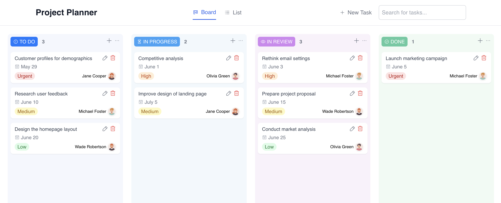

# Alpine Project Planner

Alpine Project Planner is a simple project management tool that allows users to add, edit, delete, search, and move tasks between different status columns. The application uses local storage to persist data and works on all devices.

**Demo: [alpine-project-planner.vercel.app](https://alpine-project-planner.vercel.app)**

[](https://alpine-project-planner.vercel.app)

## Features

- **Add Task**: Users can add a new task by entering the task name and clicking the "Add Task" button.
- **Edit Task**: Users can edit a task by clicking the "Edit" button, updating the task name, and clicking the "Save" button.
- **Remove Task**: Users can delete a task by clicking the "Delete" button.
- **Search Task**: Users can search for a task by entering the task name in the search bar.
- **Move Task**: Users can change task status by dragging and dropping tasks.
- **Board View**: Users can view tasks in different columns based on their status (To Do, In Progress, In Review, Done).
- **List View**: Users can view tasks in different lists based on their status (To Do, In Progress, In Review, Done).
- **Local Storage**: The application uses local storage to persist data.
- **Responsive Design**: The application is responsive and works on all devices.

## Tech Stack


- **Framework**: [Alpine.js](https://alpinejs.dev)
- **Styling**: [Tailwind CSS](https://tailwindcss.com)
- **Linting**: [ESLint](https://eslint.org)
- **Formatting**: [Prettier](https://prettier.io)
- **Testing**: [Jest](https://jestjs.io), [Cypress](https://www.cypress.io), [Cucumber](https://cucumber.io)
- **Package Manager**: [PNPM](https://pnpm.io)
- **Build Tool**: [Vite](https://vite.dev)
- **Deployment**: [Vercel](https://vercel.com)

## Getting Started

To get started with this project, follow these steps:

1. **Clone the repository**:

  ```sh
  git clone https://github.com/zorkham/alpine-project-planner.git
  ```

2. **Install dependencies**:

  ```sh
  pnpm install
  ```

3. **Run project locally**:

  ```sh
  pnpm dev
  ```

4. **Open your browser**: Go to `http://localhost:3000` to see the app in action.

## Testing

This project uses Jest, Cypress, and Cucumber for testing. To run the tests, use the following commands:

- **Unit Tests**:

  ```sh
  pnpm test
  ```

- **E2E Tests**:

  ```sh
  pnpm test:e2e
  ```

- **All Tests**:

  ```sh
  pnpm test:all
  ```

## Other Projects

- [Alpine Markt](https://github.com/Zorkham/alpine-markt)
- [Alpine Password Manager](https://github.com/Zorkham/alpine-password-manager)
- [Alpine Board Game Explorer](https://github.com/Zorkham/alpine-board-game-explorer)
